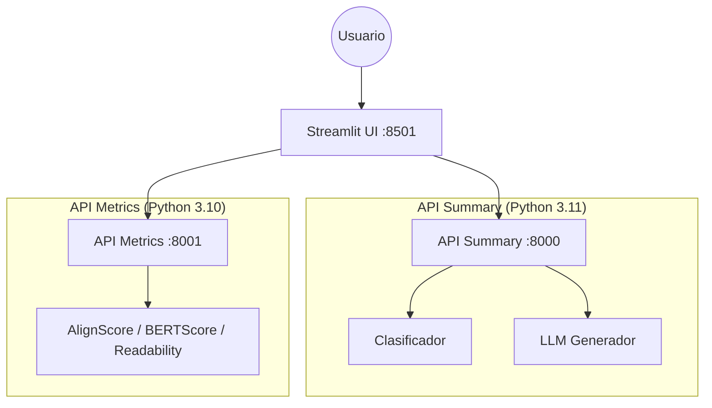

# BioLaySumm

Este repositorio contiene el código, datos y documentación del artículo de tesis de maestría "Generación automática de resúmenes en lenguaje sencillo en salud".

El objetivo central es cerrar la brecha de comprensión en salud mediante la automatización eficiente de la generación de textos accesibles, validando la viabilidad de modelos de bajo costo computacional. El sistema incluye un pipeline de clasificación, generación y evaluación automática de calidad (Factualidad, Relevancia y Legibilidad), expuesto a través de APIs REST y una interfaz gráfica interactiva.

### Resumen del Proyecto
La alfabetización en salud (\textit{Health Literacy}) es un desafío global, impactando negativamente la comprensión de tratamientos y la toma de decisiones informadas. La producción manual de Resúmenes en Lenguaje Sencillo (PLS) es costosa e inescalable.

Este proyecto aborda el problema mediante un pipeline integral de dos etapas:

- Clasificación: Discriminación automática entre textos científicos y PLS.

- Generación de PLS: Ajuste fino (\textit{fine-tuning}) de Modelos de Lenguaje Grandes (LLMs) de código abierto y tamaño reducido (<3B) utilizando QLoRA y estrategias de razonamiento (\textit{Chain-of-Thought}), enfocándose en la eficiencia y la portabilidad en entornos de hardware limitado.

La evaluación se realiza mediante un Criterio de Puntuación Compuesta (CPSC) que combina Factualidad (AlignScore), Legibilidad (Flesch y afines) y Relevancia (BERTScore). Los resultados demuestran que los modelos pequeños son competitivos en factualidad, pero la legibilidad sigue siendo el principal desafío.

## Objetivo General

Desarrollar y evaluar un pipeline eficiente y reproducible para la clasificación y generación de resúmenes biomédicos en lenguaje sencillo, demostrando su viabilidad técnica en entornos de recursos computacionales limitados.

### Objetivos Específicos

Implementar y evaluar un clasificador binario (disperso vs. contextual) que alcance alta precisión en la discriminación de textos científicos/PLS.

Ajustar modelos LLM ligeros (<3B) con QLoRA para generar PLS, comparando el rendimiento entre entornos locales (NVIDIA 4050) y en la nube (NVIDIA L4).

Cuantificar el impacto de estrategias de \textit{prompting} y razonamiento (CoT) en la factualidad y la legibilidad de los textos generados.

Definir y aplicar un Criterio de Puntuación Compuesta (CPSC) que priorice la utilidad clínica (factualidad y legibilidad) para la evaluacion todos los modelos.

---

## Tabla de Contenidos

1. [Características Principales](#-características-principales)
2. [Arquitectura del Sistema](#-arquitectura-del-sistema)
3. [Estructura del Proyecto](#-estructura-del-proyecto)
4. [Requisitos](#-requisitos)
5. [Instalación y Despliegue](#-instalación-y-despliegue)
    - [Opción 1: Docker (Recomendado)](#opción-1-docker-recomendado)
    - [Opción 2: Instalación Local](#opción-2-instalación-local)
    - [Despliegue en Cloud Run](#despliegue-en-google-cloud-run)
6. [Uso](#-uso)
7. [Modelos y Resultados](#-modelos-y-resultados)
8. [Equipo](#-equipo)

---

## Características Principales

* **Pipeline de 2 Etapas:**
    * **Clasificación:** Distingue entre textos técnicos y resúmenes simples (Precisión >99.9% con ELECTRA/Ridge).
    * **Generación:** Produce resúmenes estructurados (*Plain Title, Rationale, Trial Design, Results*) usando LLMs adaptados.
* **Modelos Eficientes:** Fine-tuning con QLoRA sobre DeepSeek-Coder 1.3B, Llama 3.2, Gemma 3 y Qwen 3.
* **Evaluación Integral:**
    * *Factualidad:* AlignScore (NLI-based).
    * *Relevancia:* BERTScore.
    * *Legibilidad:* Flesch-Kincaid, Gunning Fog, SMOG.
* **Interfaz Interactiva:** UI en Streamlit con generación en streaming (token a token).
* **Arquitectura de Microservicios:** APIs separadas para inferencia (PyTorch/CUDA) y métricas pesadas.

---

## Arquitectura del Sistema

El sistema se compone de tres servicios contenerizados:




## Arquitectura del Sistema

El repositorio sigue una estructura modular estricta para garantizar la reproducibilidad:
```text
PROYECTO-PLN-FLAG/
├── datos/                      # Datos del proyecto
│   ├── raw/                    # Corpus original (Cochrane, BioLaySumm)
│   └── pre-processed/          # Datos limpios y particionados (ej. data_finetuning_test.csv)
├── modelos/                    # Artefactos de modelos (descargados/entrenados)
│   ├── deepseek-coder-merged/  # LLM Fine-tuned final
│   ├── clasificador/           # Modelos Ridge/ELECTRA (.joblib)
│   └── alignscore/             # Checkpoints de evaluación
├── notebooks/                  # Experimentación y desarrollo
│   ├── data_prep/              # Limpieza y análisis exploratorio
│   ├── finetuning/             # Entrenamiento QLoRA (ej. entrenamiento_DeepSeek13.ipynb)
│   ├── inferencia/             # Scripts de generación y Merge de adaptadores
│   ├── evaluacion/             # Cálculo de métricas (AlignScore, BERTScore)
│   └── clasificacion/          # Entrenamiento de clasificadores
├── src/                        # Código fuente de producción
│   ├── api/                    # APIs con FastAPI
│   │   ├── summary/            # Lógica de inferencia y streaming
│   │   └── metrics/            # Lógica de evaluación (microservicio separado)
│   └── ui/                     # Interfaz de usuario (Streamlit)
├── resultados/                 # Logs de entrenamiento y CSVs de métricas
├── docker-compose.yml          # Orquestación de servicios
├── Dockerfile.* # Definiciones de contenedores
├── start.sh / start.bat        # Scripts de inicio rápido
└── README.md                   # Documentación
```

## Requisitos

* **Docker:** Docker Desktop 4.0+ y Docker Compose V2.
* **Hardware (Recomendado):**
    * **RAM:** 16GB mínimo.
    * **GPU:** NVIDIA con soporte CUDA (opcional, acelera inferencia).
    * **Espacio en disco:** ~20GB (para modelos).

---

## Instalación y Despliegue

### Opción 1: Docker (Recomendado)
Esta opción maneja automáticamente las diferentes versiones de Python requeridas entre servicios.

1.  **Clonar el repositorio:**
    ```bash
    git clone https://github.com/SebastianOrd/Proyecto-PLN-FLAG.git
    cd PROYECTO-PLN-FLAG
    ```

2.  **Iniciar servicios:**
    * **Windows:** Ejecutar `start.bat`
    * **Linux/Mac:**
        ```bash
        chmod +x start.sh
        ./start.sh
        ```

3.  **Acceder:**
    * **Frontend:** [http://localhost:8501](http://localhost:8501)
    * **Docs API Summary:** [http://localhost:8000/docs](http://localhost:8000/docs)
    * **Docs API Metrics:** [http://localhost:8001/docs](http://localhost:8001/docs)

### Opción 2: Instalación Local
> ⚠️ **Nota:** Requiere gestionar dos entornos virtuales distintos (Python 3.11 para Summary/UI y Python 3.10 para Metrics).

**1. Instalar dependencias:**

```bash
# Entorno 1: Summary & UI (Python 3.11)
python3.11 -m venv venv-main
source venv-main/bin/activate
pip install -r src/api/requeriments_summaryAPI.txt

# Entorno 2: Metrics (Python 3.10)
python3.10 -m venv venv-metrics
source venv-metrics/bin/activate
pip install -r src/api/metrics/requeriments_apiMetrics.txt
```

**2. Ejecutar Componentes**

Lanzar cada servicio en una **terminal separada**:

```bash
# Terminal 1: API Principal (Summary)
uvicorn src.api.main:app --port 8000

# Terminal 2: API de Métricas
uvicorn src.api.metrics.server:app --port 8001

# Terminal 3: Interfaz de Usuario (Streamlit)
streamlit run src/ui/app_streamlit.py
```

### Opción 3: Cloud

Lanzar cada servicio en una **terminal separada**:

```bash
# Configurar proyecto y desplegar
./deploy-cloudrun.sh  # (o .ps1 en Windows)
```

## Uso

### Interfaz web
1.  Ingresa a [http://localhost:8501](http://localhost:8501).
2. En la seccion Resumen individual
    - Pega un **Abstract biomédico** en el área de texto.
    - Haz clic en **"Generar resumen"**.
    - El sistema clasificará el texto y empieza generar el resumen.
    - Cuando el resumen se genere, se habilita **Calcular métricas del resumen**
    - Se generan las métricas de legibilidad, relevancia y factuabilidad
3. En la seccion explorar resultados
    - Puedes ver todos los resuemens generados, seleccionar laguno ver el  ttexto inciial, el reusmen y sus metricas


### API REST

#### Clasificación de texto (Científico vs. PLS)
Ejemplo mediante `cURL`:

```bash
curl -X POST "http://localhost:8000/process" \
     -H "Content-Type: application/json" \
     -d '{
           "text": "Background: Acute myocardial infarction (AMI) is a major cause of morbidity and mortality worldwide. Objective: To evaluate the efficacy of..."
         }'
```

Respuesta esperada:

```json
{
  "label": "Scientific",
  "score": 0.9998,
  "processing_time": 0.045
}
```

#### Generación de resumen en streaming
Ejemplo mediante `cURL`:

```bash
curl -X POST "http://localhost:8000/summary/stream/" \
     -H "Content-Type: application/json" \
     -d '{
           "text": "Methods: We conducted a randomized controlled trial with 500 patients...",
           "model_config": {
             "temperature": 0.2,
             "max_tokens": 512
           }
         }'
```
Respuesta esperada:

```plaintext
data: {"token": " **Plain"}
data: {"token": " Title**"}
data: {"token": ":"}
data: {"token": " New"}
...
```

#### Cálculo de Métricas de Calidad
Ejemplo para generar un resumen mediante `cURL`:

```bash
curl -X POST "http://localhost:8001/metrics" \
     -H "Content-Type: application/json" \
     -d '{
           "original_text": "The randomized control trial demonstrated a significant reduction in...",
           "summary_text": "This study showed that the new medicine helps reduce symptoms..."
         }'
```

Respuesta esperada:
```json
{
  "factual_consistency": {
    "alignscore": 0.645
  },
  "relevance": {
    "bertscore_f1": 0.848
  },
  "readability": {
    "flesch_reading_ease": 65.4,
    "flesch_kincaid_grade": 8.2
  }
}
```


## Modelos y Resultados

El sistema fue evaluado comparando múltiples LLMs ligeros. El mejor desempeño se obtuvo con **DeepSeek-Coder 1.3B** usando Optimized Prompting.

| Modelo | Estrategia | BERTScore (F1) | AlignScore (Factualidad) | Legibilidad (FRE) |
| :--- | :---: | :---: | :---: | :---: |
| **DeepSeek-Coder 1.3B** | **OPT** | **0.848** | **0.646** | **56.9** |
| Llama 3.2 1B | OPT | 0.858 | 0.468 | 51.7 |
| Gemma 3 1B | OPT | 0.856 | 0.474 | 51.0 |
| GPT-4o (Referencia) | - | - | 0.820 | 81.9 |


## Equipo

Proyecto desarrollado como parte de la **Maestría en Inteligencia Artificial**, Universidad de los Andes.

* Brayan Sthefen Gomez Salamanca
* Juan Sebastian Ordoñez Acuña
* Maria Alejandra Rojas Garzon
* Hainer Jair Torrenegra Jimenez

